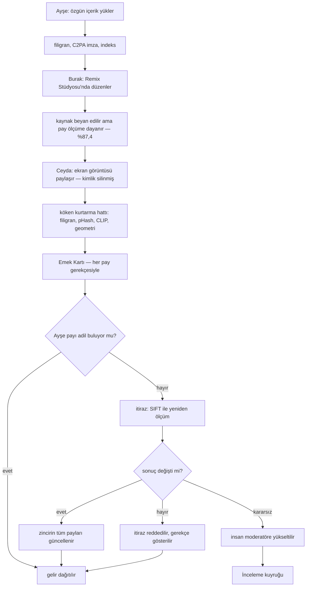
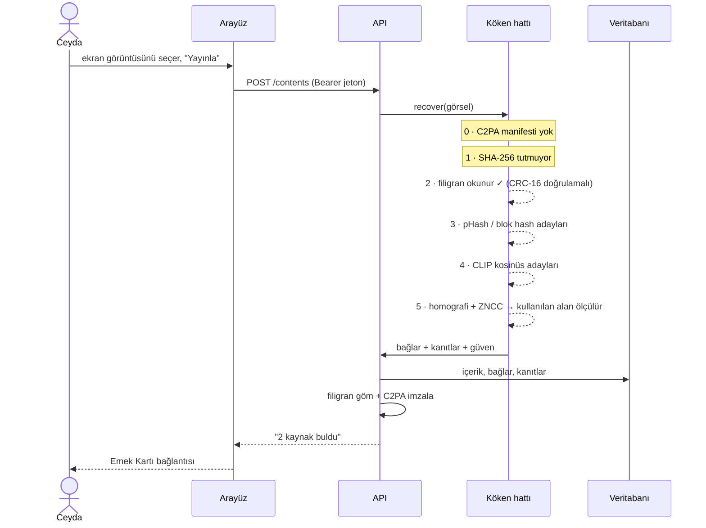
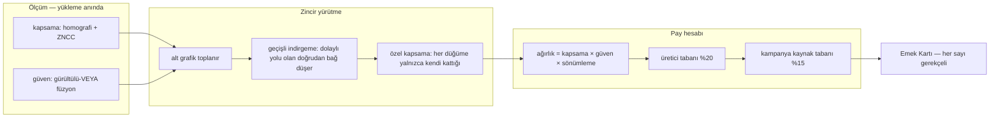
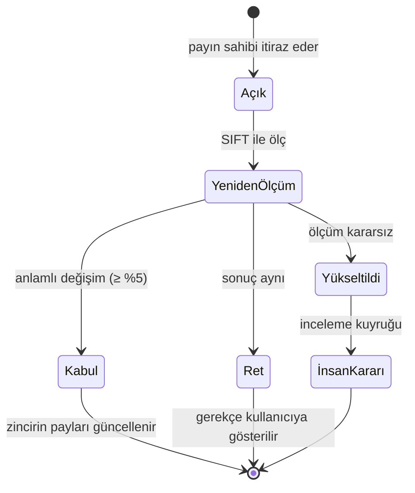
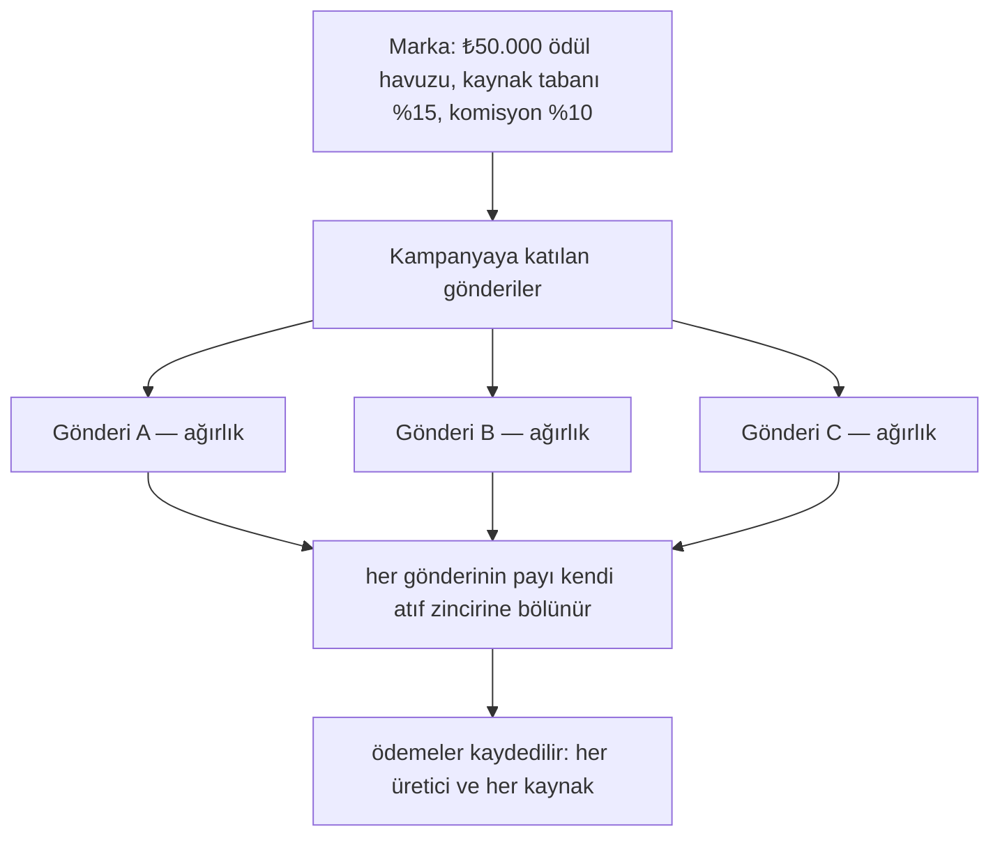
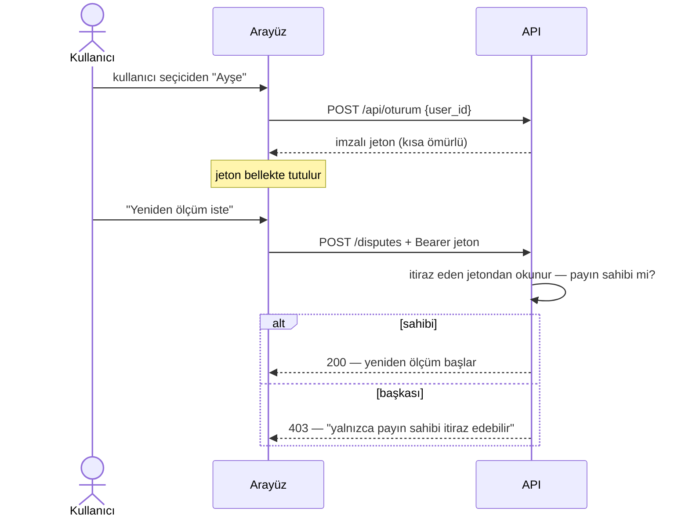

# Kullanıcı Akışları ve Senaryo

**Bu doküman sistemi kullanıcı gözünden anlatır:** kim ne yapıyor, ekranda ne görüyor,
arkada ne oluyor. Teknik akış `MIMARI.md`'de, ekran ekran kullanım `REHBER.md`'de.
Burası ikisinin arasındaki boşluk — *yolculuk*.

Bütün sayılar demo verisinden (altın senaryo) ve ölçülmüştür; hiçbiri örnek amaçlı
uydurulmadı. Yeniden üretmek için: `docker compose up --build` → `http://localhost:5173`.
Ekran görüntüleri `gorseller/` altında.

---

## 1. Aktörler ve ne istedikleri

| Aktör | Kim | Ne istiyor | Bugün ne oluyor |
|---|---|---|---|
| **Ayşe** | Özgün içerik üreticisi | Kendi karesi başkalarının gönderilerinde dolaşırken emeğinin görünmesi | İçerik kırpılıp yeniden paylaşılınca izi kayboluyor |
| **Burak** | Remix üreticisi | Kaynağı hakkıyla anmak ama kendi katkısının da sayılması | "Ya hiç anmam ya da her şeyi ona veririm" ikilemi |
| **Ceyda** | Paylaşan | Bulduğu içeriği paylaşırken kimseyi mağdur etmemek | Kaynağı bilmiyor bile; ekran görüntüsü kimliği siliyor |
| **Marka** | Kampanya sahibi | Ödül havuzunun gerçek katkıya göre bölünmesi | Yalnızca son paylaşana ödeme yapılıyor |
| **Moderatör** | Platform | Otomatik karar veremeyen durumu görmek | Karar veremeyen sistemler bunu gizliyor |

---

## 2. Altın senaryo — beş sahne

Zincir: **Ayşe → Burak → Ceyda.** Kritik an üçüncü sahnede: içerik sisteme "kaynağı
yokmuş" gibi girer.

### Sahne 1 — Ayşe özgün içeriğini yükler

| | |
|---|---|
| **Ne yapar** | Akış ekranında "İçerik yükle", fotoğrafını seçer, remix iznini açık bırakır |
| **Ne görür** | "Yayınlandı. Kaynak bulunamadı; içerik özgün kabul edildi ve imzalandı." |
| **Arkada ne olur** | Parmak izi çıkarılır, görünmez filigran gömülür, C2PA manifesti imzalanır, FAISS'e eklenir. Köken hattı yine de koşar — "bu benim" iddiası da doğrulanır |
| **Süre** | ~666 ms |

> Yayınlanan dosya, yüklenen dosya değildir: filigranlı ve imzalı sürümdür. Zincir
> dosyanın *içinde* seyahat eder.

### Sahne 2 — Burak remixler

| | |
|---|---|
| **Ne yapar** | Ayşe'nin içeriğinde "Remixle" → Remix Stüdyosu'nda kırpar, yazı ekler, çizim yapar |
| **Ne görür** | "Yayınlandı. Kaynaktan gelen bölümün oranı %87,4 olarak ölçüldü." |
| **Arkada ne olur** | Her araç bir C2PA eylemine karşılık gelir (`c2pa.cropped`, `c2pa.drawing`). Kaynak *beyan* edilir ama pay beyana değil **ölçüme** dayanır: homografi + piksel doğrulaması alanı ölçer |
| **Süre** | ~569 ms |
| **Görsel** | `gorseller/07-remix-studyosu.jpg` |

> Ayırt edici nokta burada: stüdyo kaynağı beyan eder, sistem ne kadarını kullandığını
> **kendisi ölçer**. Kullanıcı "%10 kullandım" dese bile ölçüm %87 diyorsa pay ölçüme göre.

### Sahne 3 — Ceyda ekran görüntüsünü paylaşır · *kritik an*

| | |
|---|---|
| **Ne yapar** | Burak'ın gönderisinin ekran görüntüsünü alır ve yükler. Kaynak beyan etmez — bilmiyor bile |
| **Ne görür** | "Yayınlandı. Köken hattı 2 kaynak buldu — içeriğe girip Emek Kartı'na bakın." |
| **Arkada ne olur** | Ekran görüntüsü C2PA manifestini **siler**. Hat sırayla dener: kimlik yok → dosya özeti tutmuyor → **filigran okunur** → görüntü parmak izi ve CLIP adayları verir → homografi + ZNCC alanı ölçer. Burak bulunur, onun üzerinden Ayşe de |
| **Süre** | ~476 ms |
| **Görsel** | `gorseller/02-emek-karti-koken.jpg` |

Emek Kartı bunu açıkça yazar: **"Yüklenen dosyada kimlik: yoktu · Yayınlanan sürüm:
imzalandı"** ve *"Köken, kanıt zinciriyle yeniden kuruldu."* Güven **0,98**.

### Sahne 4 — Gelir dağılır

Gönderi ₺4.200,00 kazanır. Emek Kartı payı gerekçesiyle birlikte gösterir:

| Taraf | Rol | Pay | Tutar | Neden |
|---|---|--:|--:|---|
| Ceyda Aksoy | üretici | %20,0 | ₺756,00 | Üretici tabanı — hiçbir paylaşım "sıfır emek" değildir |
| Ayşe Yılmaz | kaynak | %68,1 | ₺2.575,33 | Kendi kattığı alan %85,2 · zincirde 2 adım geride |
| Burak Demir | kaynak | %11,9 | ₺448,67 | Kendi kattığı alan %12,2 · toplam görünen %97,5 |
| N'Sosyal | platform | %10,0 | ₺420,00 | Komisyon |

Ayşe'nin satırı açıldığında formül görünür:

```
pay = kapsama %85,2 × güven 0,95 × sönümleme 0,85 = 0,692
```

Ve uygulanan kural yazılır: *"Kaynakların toplamı %81,2 idi; üreticiye bırakılan %20,0
taban için oranlı olarak %80,0 düzeyine çekildi."*

> **Burak neden yalnızca %12,2?** Toplam görünen alanı %97,5 ama bunun büyük kısmı
> Ayşe'den geliyor. Her tarafa yalnızca **kendi kattığı** pikseller yazılır, yoksa aynı
> emek iki kez ödüllendirilirdi. Ekranda ikisi de gösterilir: "kendi kattığı alan %12,2 ·
> toplam görünen %97,5".

**Görsel:** `gorseller/03-pay-gerekcesi.jpg` · ölçülen bölge: `gorseller/05-olculen-bolge-oran.jpg`

### Sahne 5 — Ayşe itiraz eder

| | |
|---|---|
| **Ne yapar** | Kendi pay satırını açar, "Yeniden ölçüm iste", gerekçesini yazar |
| **Ne görür** | Bağın SIFT ile yeniden ölçüldüğünü ve sonucu anlatan bir özet |
| **Arkada ne olur** | Daha hassas dedektörle yeniden ölçüm. Sonuç anlamlı değişirse zincirin **tüm payları** güncellenir; değişmezse itiraz reddedilir; ölçüm kararsız kalırsa insana yükseltilir |
| **Süre** | ~79 ms |

Yetki kuralı: itirazı **yalnızca payın sahibi** açabilir. Ayşe'nin satırında düğme var,
Burak'ın satırında yok.

---

## 3. Akış diyagramları

### 3.1 Kullanıcı yolculuğu — uçtan uca



### 3.2 Kimliksiz içerik yükleme — sahne 3'ün içi



### 3.3 Emek Kartı üretimi — payın gerekçesi nereden geliyor



### 3.4 İtiraz — durum makinesi



> Üç sonucun da kullanıcıya *ayrı ayrı* gösterilmesi bilinçli. Karar veremediğini gizleyen
> bir sistem, verdiği kararlarda da güvenilir olmaz.

### 3.5 Kampanya havuzunun dağıtımı



---

## 4. Hangi soru hangi ekranda cevaplanıyor

| Kullanıcının sorusu | Ekran | Görsel |
|---|---|---|
| "Bu içerik kimden geliyor?" | Emek Kartı → Köken | `02-emek-karti-koken.jpg` |
| "Neden bana bu kadar geldi?" | Emek Kartı → pay satırını aç | `03-pay-gerekcesi.jpg` |
| "Gerçekten benim mi kullanılmış?" | Ölçülen bölge — yeşil maske | `05-olculen-bolge-oran.jpg` |
| "Zincir nasıl kurulmuş?" | Atıf zinciri | `06-atif-zinciri.jpg` |
| "Katılmıyorum, ne yapabilirim?" | Pay satırı → "Yeniden ölçüm iste" | `03-pay-gerekcesi.jpg` |
| "Bu görselin kaynağı ne?" (yüklemeden) | Kaynak bul | `10-kaynak-bul.jpg` |
| "Havuzum nasıl bölünecek?" | Kampanyalar | `08-kampanya-paneli.jpg` |
| "Sistem karar veremediğinde ne oluyor?" | İnceleme kuyruğu | `09-inceleme-kuyrugu.jpg` |

---

## 5. Kullanıcı ne zaman ne görür — kenar durumlar

Bunlar da tasarımın parçası: sistemin bilmediğini söylediği anlar.

| Durum | Kullanıcı ne görür | Neden böyle |
|---|---|---|
| Kaynak bulunamadı | "Kaynak bulunamadı; içerik özgün kabul edildi ve imzalandı." | Yanlış atıf, kaçırılmış atıftan ağırdır |
| Alan ölçülemedi | Zincirde **"ölçülemedi"** rozeti; payda ihtiyatlı tavan %35 uygulanır ve bu yazılır | Ölçemediğimizi yüksek varsaymayız |
| Bağ zayıf | **Kesikli çizgi** — "henüz onaylanmamış (önerilen) bağ" | Sistem "sahibi budur" demez, kanıtlı öneri sunar |
| Ara halkanın payı eşiğin altında | Düğüm grafikte kalır: **"ARA HALKA · PAY YOK"** | Düğüm silinirse zincir ikiye bölünür ve anlaşılmaz olur |
| Üretici remix iznini kapatmış | "remix kapalı"; Remix Stüdyosu açılmaz (**403**) | Üretici tercihi API katmanında da uygulanır |
| Başkasının payına itiraz | Düğme hiç görünmez; uç **403** döner | İtirazı yalnızca payın sahibi açabilir |
| Başkasının içeriğinde gelir değişikliği | Uç **403** | Gelir tüm zincirin paylarını belirler |
| Oturum süresi dolmuş | Görünür bir şey yok; arayüz sessizce yeniden oturum açar | Demonun ortasında duvara toslanmasın |
| Dosya çok büyük | "Dosya çok büyük: en fazla 32 MB kabul ediliyor." (**413**) | Tek istek sunucunun belleğini tüketmesin |
| Bir ekran çökerse | "Bu ekran açılamadı" paneli; **başlık ve gezinme ayakta kalır** | Beyaz ekran yerine çıkış yolu |

---

## 6. Yetki kuralları kullanıcıya nasıl yansıyor

Üstteki kullanıcı seçici yalnızca bir demo kolaylığı değil: seçim yapmak **oturum
açmaktır**. Arka planda imzalı, kısa ömürlü bir jeton alınır ve kullanıcı adına iş yapan
uçlar bu jetona bakar.



Ekranda görünür bir değişiklik yoktur; değişen şey, önce herkesin herkes adına işlem
yapabiliyor olmasıydı.

---

## 7. Ölçülmüş süreler

Kullanıcının beklediği yerler (`GECIKME.md`, elle yazılmadı — betik çıktısı):

| Adım | Ortalama |
|---|--:|
| Özgün içerik yükleme | 666 ms |
| Remix yükleme | 569 ms |
| Kimliksiz içerik yükleme (tam kurtarma hattı) | 476 ms |
| Emek Kartı üretimi | 6 ms |
| Kampanya dağıtımı | 31 ms |
| İtiraz çözümü (SIFT ile yeniden ölçüm) | 79 ms |

Maliyetin tamamı köken kurtarmada; açıklama katmanı (Emek Kartı) pratikte bedava.
