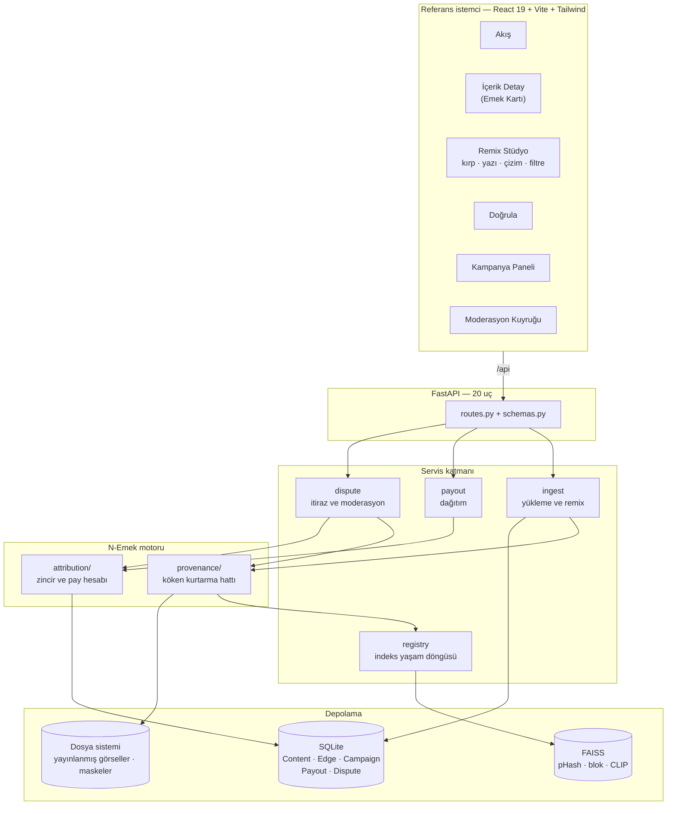
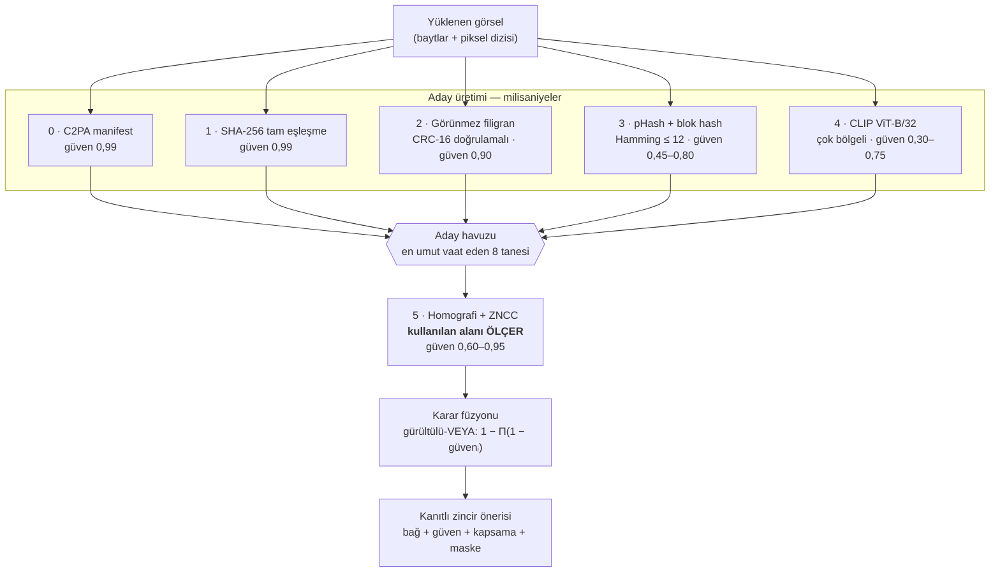
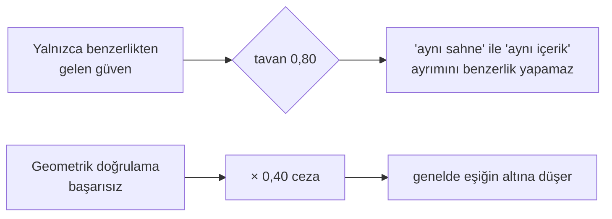
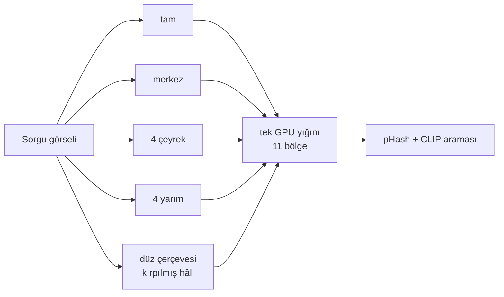
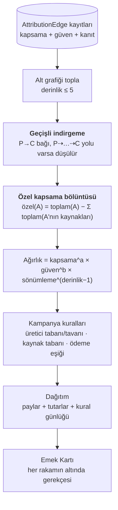
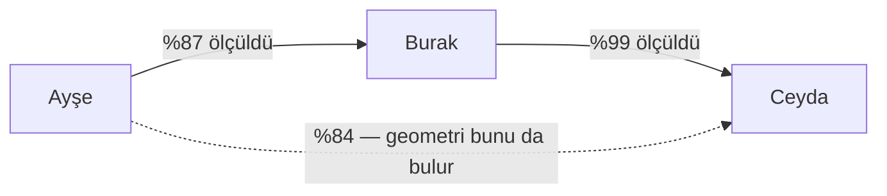
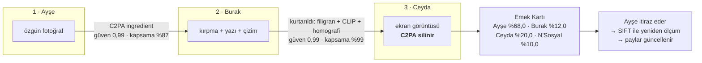

# N-Emek — Sistem Mimarisi

Bu belge sistemin nasıl kurulduğunu ve verinin nasıl aktığını anlatır. Ölçüm sonuçları
için `DEGERLENDIRME.md` ve `FAZ0-SONUCLARI.md`, gecikmeler için `GECIKME.md`.

---

## 1. Katmanlar

N-Emek bir sosyal platformun yerine geçmez; ona takılan bir **emek katmanı**dır. Prototipte
platformun kendisi de var, çünkü katmanın nereye takılacağını göstermek gerekiyor.



**Neden bu ayrım:** `provenance/` ve `attribution/` veritabanını tanımaz. `recovery.recover()`
bir `ContentStore` protokolü alır, `contribution.compute_shares()` saf bir fonksiyondur.
Bu sayede değerlendirme betikleri (`eval/`) motoru SQLAlchemy olmadan koşturabiliyor ve
pay formülü 22 birim testiyle sabitlenebiliyor.

---

## 2. Köken kurtarma hattı

Projenin ayırt edici parçası. Mantığı iki aşamalı: **ucuz aday üretimi**, ardından
**pahalı doğrulama**.



### Neden gürültülü-VEYA

Her aşama kaynağı **bağımsız bir fiziksel izden** buluyor: metadata, bayt özeti, frekans
alanı, piksel istatistiği, yerel geometri. Aynı sonuca farklı yollardan varmaları güveni
artırmalı; toplamsal bir model bunu ifade edemezdi.

### İki emniyet supabı



Yanlış atıf, kaçırılmış atıftan ağırdır. Eşikler bu yönde hata payı bırakacak şekilde
ayarlandı.

### Çok bölgeli sorgu

Ölçüm sonucu eklenen bir tasarım kararı. Kaynak, türev tuvalinin yalnızca bir bölümünü
kapladığında (meme, kolaj, kırpma+yazı) global tanımlayıcılar tüm tuvali görüyor ve
kaçırıyordu. Sorgu görseli sabit bir bölge kümesine ayrılıp her bölge ayrı aranıyor.



Ortalama geri getirme %88,5 → %99,2. İndeks tarafı değişmedi; maliyet yalnızca sorgu anında.

---

## 3. Katkı payı: ölçümden paya

Sistemin ikinci yarısı. Buradaki iki kural (**geçişli indirgeme** ve **özel kapsama
bölüntüsü**) sonradan "sadeleştirme" diye kaldırılmamalı; ikisi de ölçümdeki gerçek bir
hatayı düzeltiyor.



### Geçişli indirgeme neden gerekli



Geometri, Ayşe'nin içeriğini Ceyda'nın gönderisinde de bulur — pikseller oraya Burak
üzerinden gelmiştir. Kesikli bağ pay hesabına girerse aynı emek iki kez ödüllendirilir.
Veritabanında kanıt olarak kalır, hesaba girmez.

**Bu düzeltmeden önce kaynakların toplamı %182 çıkıyordu.**

### Özel kapsama neden gerekli

Ölçülen kapsamalar iç içedir: Burak'ın %97'si Ayşe'nin %84'ünü de kapsar. Her düğüme
yalnızca kendi kattığı pikseller yazılır. Böylece kapsamalar görselin tam bir bölüntüsü
olur ve **doğal olarak 1,0'a toplanır** — pay normalizasyona değil ölçüme dayanır.

Bu düzeltmenin bir sonucu oldu: `chain_damping` 0,50'den **0,85**'e çıkarıldı. Agresif
sönümleme, tam da bu projenin düzeltmeye çalıştığı haksızlığı üretiyordu — ilk üretici,
başkaları remixlediği için cezalandırılmış oluyordu.

---

## 4. Yükleme akışı: neden iki kez parmak izi

```mermaid
sequenceDiagram
    participant K as Kullanıcı
    participant A as API
    participant R as recovery
    participant W as watermark + C2PA
    participant I as indeks

    K->>A: görsel yükler
    A->>R: 1· GELEN dosya üzerinde köken kurtarma
    Note over R: kullanıcının getirdiği şey ne ise onun<br/>üzerinde çalışırız: manifesti silinmiş,<br/>ekran görüntüsü alınmış, kırpılmış hâli
    R-->>A: bağlar + kanıtlar + maskeler
    A->>W: 2· filigran göm, manifest imzala
    W-->>A: yayınlanacak dosya (baytlar değişti)
    A->>I: 3· YAYINLANAN dosya üzerinden indeksle
    Note over I: başkaları bu hâli indirip remixleyecek;<br/>indekste duran parmak izi de bu olmalı
    A-->>K: içerik + zincir önerisi
```

Bu ayrımı atlamak, kendi yayınladığımız içeriğin birebir kopyasını tanıyamamamıza yol açar.

---

## 5. Altın senaryo — demoda görülen zincir



Üçüncü adım senaryonun kritik anıdır: içerik sisteme "kaynağı yokmuş" gibi girer, hat
Burak'ı **ve** onun üzerinden Ayşe'yi bulur, eşleşen bölge maskeyle gösterilir.

---

## 6. Ölçeklenebilirlik

Prototipte iki FAISS indeksi de "flat" (kaba kuvvet). On binler mertebesinde fazlasıyla
hızlı ve %100 geri getirme garantili. `GECIKME.md`, maliyetin tamamen köken kurtarmada
olduğunu gösteriyor; büyümede iki düğme var:

| Darboğaz | Bugün | Ölçekte |
|---|---|---|
| Aday arama | `IndexBinaryFlat` + `IndexFlatIP` | IVF-PQ / HNSW — `ProvenanceIndex` arayüzü aynı kalır |
| Geometrik doğrulama | aday başına ~90 ms, en fazla 8 aday | `max_geometry_candidates` ayarı; kuyruk üzerinden asenkron |
| CLIP gömme | tek GPU, yığın 32 | gömme çevrimdışı; yatay ölçeklenir |
| Veritabanı | SQLite | PostgreSQL — SQLAlchemy modeli değişmez |
