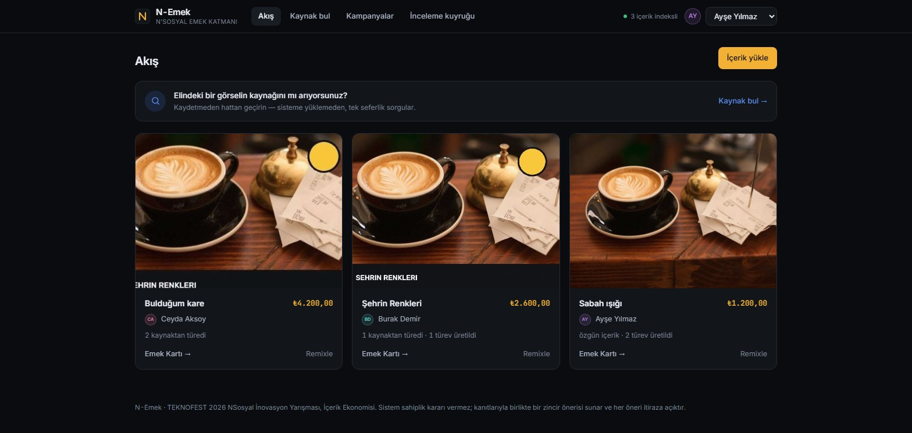
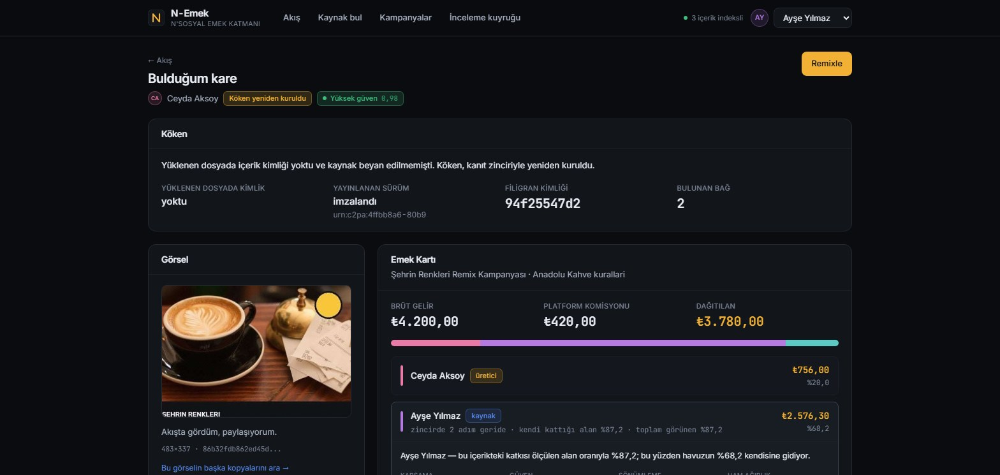
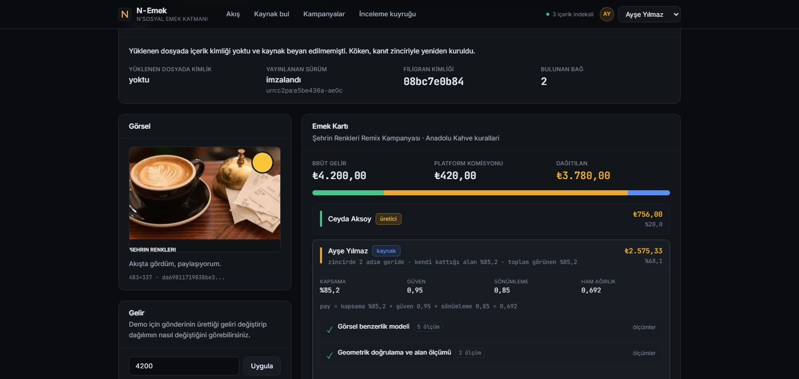
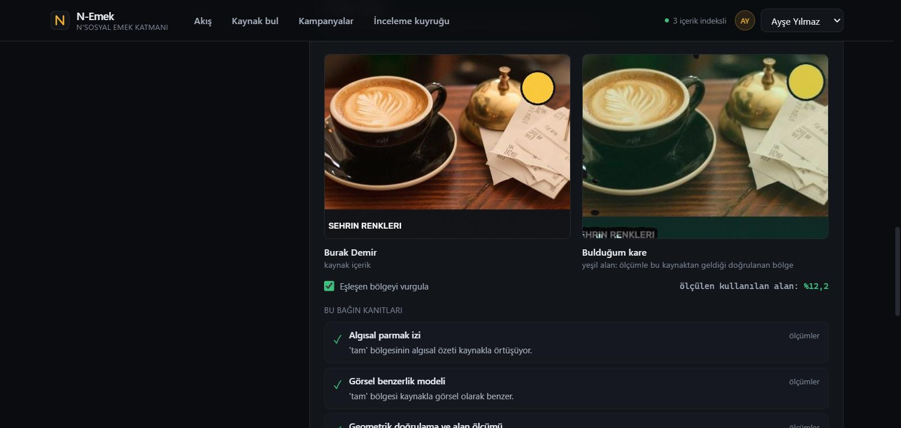

# Sunum İçeriği — Jüri Sunumu

**Bu dosya slayt içeriğidir**, tasarlanmış sunum değil. Marp uyumlu yazıldı ve
`marp SUNUM.md --pdf` ile doğrudan slayta çevrilebilir (`docs/gorseller/SUNUM.pdf`
bu şekilde üretildi). **12 Eylül'de organizasyon jüri günü için zorunlu bir sunum
şablonu duyurdu** (henüz paylaşılmadı) — şablon geldiğinde bu içerik ona taşınacak.

**Hedef süre (güncellendi, 12 Eylül):** Jüri günü **15 dakika sunum + 2–3 dakika canlı
prototip gösterimi**, ardından jüri soruları. Aşağıdaki içerik ve zamanlama tablosu
eski "8–10 dakika" hedefine göre kuruldu (≈10:00 toplam) — kalan ~5 dakika, zorunlu
şablon geldiğinde şu eksenlerden biri veya birkaçı derinleştirilerek doldurulacak:
ölçüm yönteminin daha ayrıntılı anlatımı, ürün yol haritası, benzer çözümlerle
karşılaştırma. Puan ağırlıklarının altısını da karşılayacak şekilde sıralandı:
Yenilikçilik %20 · Teknik Yeterlilik %20 · Problem Çözme %20 · UI/UX %20 · Sunum ve
Prototip %10 · İş Modeli %10.

Görseller `gorseller/` klasöründen. Her sayı ölçüm çıktısıdır.

---

## 1 · Kapak

# N-Emek

**Açıklanabilir içerik atıf ve adil gelir paylaşım sistemi**

TEKNOFEST 2026 · NSosyal İnovasyon Yarışması · İçerik Ekonomisi

**Takım ZENITH N**
<!-- Üye isimleri bilinçli olarak yok: teknik raporun 8. bölümü
     ("Takım Yapısı"), değerlendirme esasları gereği isim/fotoğraf gibi
     kişisel bilgilerin rapora girmediğini söylüyor. Slaytta da aynı
     kural izlendi; sunumu yapan kişi kendini sözlü olarak tanıtır. -->

*[sunumu yapacak kişi(ler) kendini sözlü olarak tanıtabilir]*

---

## 2 · Problem · 45 sn

# Emek zincirin sonunda kayboluyor

Bir fotoğraf çekiliyor → kırpılıp üstüne yazı ekleniyor → ekran görüntüsü alınıp
paylaşılıyor.

Üçüncü paylaşımda içerik binlerce kez görülüyor, marka sponsorluğu geliyor —
**ilk üreticinin adı hiçbir yerde yok.**

> Sorun kötü niyet değil: zincir **teknik olarak** kopuyor.
> Ekran görüntüsü, içeriğin kimliğini tek tıkla siliyor.



---

## 3 · Neden mevcut çözümler yetmiyor · 30 sn

| Yaklaşım | Neden yetmiyor |
|---|---|
| Elle atıf / etiketleme | İyi niyete bağlı; kırpma zinciri koparıyor |
| Yalnızca C2PA | Metadata silinince zincir de gidiyor |
| Yalnızca filigran | Kırpmaya dayanmıyor, kapsama ölçemiyor |
| Benzerlik araması | Kaynağı *bulur*, **ne kadar kullanıldığını ölçemez** |

**Eksik olan:** ölçüm.

---

## 4 · Ayırt edici iddia · 30 sn  ⟨Yenilikçilik⟩

# Bulmak değil, **ölçmek**

Katkı payı tahmine değil, **homografi + piksel doğrulamasıyla ölçülmüş alan oranına**
dayanıyor.

- Kaynağı bulmak: çözülmüş bir problem
- Kaynağın **ne kadarının** kullanıldığını ölçmek: pay hesabının önkoşulu

> Bu ayrım, sistemin gelir dağıtabilmesinin tek nedeni.

---

## 5 · Nasıl çalışıyor — beş aşama · 60 sn  ⟨Teknik Yeterlilik⟩

| # | Aşama | Yöntem | Güven |
|---|---|---|---|
| 0 | İçerik kimliği | C2PA manifest | 0,99 |
| 1 | Tam eşleşme | SHA-256 | 0,99 |
| 2 | Filigran | DCT + CRC-16 | 0,90 |
| 3 | Parmak izi | pHash / blok hash | 0,45–0,80 |
| 4 | Görsel benzerlik | CLIP ViT-B/32 | 0,30–0,75 |
| 5 | **Alan ölçümü** | **Homografi + ZNCC** | **0,60–0,95** |

**Ucuz aday üretimi → pahalı doğrulama.** Karar füzyonu gürültülü-VEYA.

---

## 6 · Yapay zekâ nerede — ve nerede değil · 45 sn  ⟨Teknik Yeterlilik⟩

# Öğrenen tek bileşen karar vermiyor

- **CLIP** aday üretiyor — "şu görsel şuna benziyor"
- Kararı **geometrik ölçüm** veriyor — deterministik, tekrar üretilebilir
- Eğitim yok: ölçülebilen bir şeyi tahmine çevirmek istemedik

> Bir kullanıcı itiraz ettiğinde "modelimiz böyle öğrendi" diyemeyiz.
> Bu yüzden her sayının arkasında ya imza, ya hash, ya da tekrar edilebilir bir ölçüm var.

---

## 7 · Kritik an — kimliği silinmiş içerik · 45 sn  ⟨Problem Çözme⟩

# Ekran görüntüsü kimliği siler; sistem zinciri geri kurar

Yüklenen dosyada kimlik **yoktu**. Sistem iki kaynağı da buldu:
Burak'ı **ve** onun üzerinden Ayşe'yi. Güven **0,98**.



---

## 8 · Her rakamın altında gerekçesi · 60 sn  ⟨UI/UX⟩

# Emek Kartı

```
pay = kapsama %85,2 × güven 0,95 × sönümleme 0,85 = 0,692
```

| Taraf | Pay | Neden |
|---|--:|---|
| Ceyda (üretici) | %20,0 | Üretici tabanı |
| **Ayşe (kaynak)** | **%68,1** | Kendi kattığı alan %85,2 · 2 adım geride |
| Burak (kaynak) | %11,9 | Kendi kattığı alan %12,2 |
| N'Sosyal | %10,0 | Komisyon |



---

## 9 · Ölçüm görünür · 45 sn  ⟨UI/UX⟩

# "Ölçtük" derken ne demek istiyoruz

Yeşil alan: ölçümle o kaynaktan geldiği **doğrulanmış** piksel bölgesi.
Kararan yerler o kaynaktan gelmiyor.

**Ölçülen kullanılan alan: %12,2**



---

## 10 · Sistem asla ne demez · 30 sn  ⟨Problem Çözme⟩

# "Bu içeriğin sahibi budur."

Sistem **kanıtlı zincir önerisi** sunar:

- Onaylanmamış bağ **kesikli** çizilir
- Ölçülemeyen kapsama **"ölçülemedi"** yazar — sayı uydurulmaz
- Her bağ **itiraza açık**; çözülemeyen itiraz **insana** gider

> Karar veremediğini gizleyen bir sistem, verdiği kararlarda da güvenilir olmaz.

---

## 11 · Ölçülmüş sonuçlar · 45 sn  ⟨Teknik Yeterlilik⟩

| Metrik | Sonuç |
|---|---|
| Top-1 doğruluk (20 senaryo, **6.400 sorgu**) | **%98,7** |
| **Yanlış atıf oranı** | **%0,86** (55/6400) |
| Kapsama ölçüm hatası (MAE) | **0,0241** (hedef ≤ 0,05) |
| Uçtan uca gecikme | p50 **386 ms** |
| Emek Kartı üretimi | 6 ms |

> **Negatif kontrol:** 40 görsel indekse hiç alınmadı. O sorgularda önerilen *herhangi
> bir* bağ yanlış atıf sayıldı. Tablonun en önemli sütunu bu.

---

## 12 · İş modeli · 45 sn  ⟨İş Modeli⟩

# Havuz, ölçülmüş katkıya bölünüyor

Marka kampanyası ₺50.000 · komisyon %10 → platforma ₺5.000

| Kişi | Bugünkü model | N-Emek ile |
|---|--:|--:|
| Ayşe (özgün üretici) | ₺6.750 | **₺34.545,80** |
| Burak (remixleyen) | ₺14.625 | ₺5.729,20 |
| Ceyda (paylaşan) | ₺23.625 | ₺4.725,00 |

> **Havuz büyümüyor, yer değiştiriyor.** İddiamız "herkes kazanır" değil,
> "ödeme ölçülmüş katkıya gider."

---

## 13 · Neden sürdürülebilir · 30 sn  ⟨İş Modeli⟩

- **Yeni davranış icat etmiyor** — marka kampanyası zaten var, biz bölünme kuralını
  değiştiriyoruz
- **Maliyet tek seferlik** — içerik bir kez işlenir, sonsuz kez dağıtıma girer
- **Katman olarak konumlanıyor** — bağımsız sosyal ağ kurmuyoruz
- Teşvikler hizalı: üretici için remix artık kayıp değil

---

## 14 · Prototip gerçekten çalışıyor · 30 sn  ⟨Prototip Kalitesi⟩

```bash
docker compose up --build     # tek komut
```

| | |
|---|---|
| Test | **130 test** backend + **124 test** arayüz <!-- sayim: backend, arayuz --> |
| CI | GitHub Actions, her gönderimde yeşil |
| Açılış (280 içerik) | 11,5 sn → **16 ms** |
| Ekranlar | 6 · mobil uyumlu · erişilebilirlik değerlendirmesi yapıldı |

> Ölçüm betikleri depoda: her performans iddiası çalıştırılabilir.

---

## 15 · Dürüst sınırlar · 30 sn

Saklamıyoruz — jüri karşısında güvenilirliği bu sağlar.

| Sınır | Durum |
|---|---|
| Kırpma %30'un altında Top-1 | %92,5 |
| Filigran döndürme/kırpmaya dayanmıyor | 3–5. aşamalar bu iş için |
| Sentetik yeniden çizim | Ölçülemez — "ölçülemedi" denir |
| Ödemesi olan içerik silinemez | Silme hakkı bu durumda tam karşılanmıyor; çözümü ödeme kayıtlarının anonimleştirilmesi |
| Kullanıcı silme yok | Yalnızca içerik silinebiliyor — ürünleşmede eklenecek |
| Kullanılabilirlik testi | 5 katılımcıyla koşuldu, SUS **60,0** — hedef 68'in altında, yedi bulgu kaydedildi — `KULLANILABILIRLIK-SONUCLARI.md` |

---

## 16 · Yaygın etki · 20 sn

- **Üretici:** remix artık kayıp değil, kazanç
- **Platform:** üretici bağlılığı + marka bütçesi çeken kanıtlanabilir altyapı
- **Ekosistem:** C2PA'nın yalnızca doğrulama için değil **ekonomik paylaşım** için
  kullanıldığı ilk örneklerden; kimlik silindiğinde de çalışan kurtarma katmanı
- **Yöntemsel:** "kullanılan oranın ölçülmesi" telif müzakeresi ve atıf zorunluluğuna da
  taşınabilir

---

## 17 · Kapanış

# Emek görünür olsun diye — tahminle değil, ölçümle

**Demo:** `docker compose up --build` → http://localhost:5173

*[iletişim / depo bağlantısı]*

---

# Sunum notları

## Zamanlama

| Bölüm | Slayt | Süre |
|---|---|--:|
| Problem ve konum | 2–4 | 1:45 |
| Teknik | 5–7 | 2:30 |
| Ürün (UI/UX) | 8–10 | 2:15 |
| Sonuçlar | 11 | 0:45 |
| İş modeli | 12–13 | 1:15 |
| Prototip ve sınırlar | 14–15 | 1:00 |
| Etki ve kapanış | 16–17 | 0:30 |
| **Toplam** | | **≈ 10:00** |

**15 dakikalık oturumda dağılım (12 Eylül'den, güncel):** Yukarıdaki tablo eski 8–10
dakikalık hedefe göredir. Jüri günü toplam süre 15 dk sunum + 2–3 dk canlı prototip;
mevcut ≈10:00'lık içerik korunur, kalan ~5 dakika zorunlu şablon geldiğinde eklenecek
derinleştirmeye ayrılır (bkz. dosya başındaki not). Şablon kısıtı süreyi daraltırsa:
slayt 3, 13 ve 16 kısaltılır. Slayt 8 ve 9 **asla** kısaltılmaz.

## Beklenen sorular ve kısa cevaplar

**"Yanlış atıf yaparsa ne olur?"**
Ölçülen oran %0,86 ve eşikler bilerek bu yönde ayarlı — yanlış atıf, kaçırılmış atıftan
ağır sayılıyor. Her bağ itiraza açık, itiraz yeniden ölçüm tetikliyor, çözülemezse insana
gidiyor.

**"CLIP hazır model, sizin katkınız ne?"**
CLIP yalnızca aday üretiyor. Katkı, ölçüm katmanında: çok bölgeli sorgu (geri getirme
%88,5 → %99,2), geçişli indirgeme, özel kapsama bölüntüsü ve bunları paya çeviren
açıklanabilir formül.

**"Ölçekte çalışır mı?"**
Maliyet içerik başına tek seferlik. Açılış 280 içerikte 16 ms. FAISS flat indeksler
IVF-PQ/HNSW'ye taşınabilir, arayüz aynı kalır.

**"Kişisel veri işliyor musunuz?"**
Kullanıcı kaydında e-posta bile yok. Yüz tanıma, profilleme, davranış takibi yok. Ama
içerik kişisel veri içerebilir; bunu `VERI-MODEL-ETIK.md`'de açıkça yazdık.

**"Neden model eğitmediniz?"**
Ölçülebilen bir şeyi tahmine çevirmemek için. Ayrıca "bu türevde kaynağın %41'i var" diye
etiketli veri yok — üretmek için zaten geometrik ölçüm gerekiyor.

**"Havuz büyümüyorsa remixleyen neden kullansın?"**
Üretici tabanı %20 garanti. Ayrıca bugün remixleyen, kaynağı andığında payını sıfırlama
riskiyle karşılaşıyor; burada kendi katkısı ayrıca ölçülüyor.
