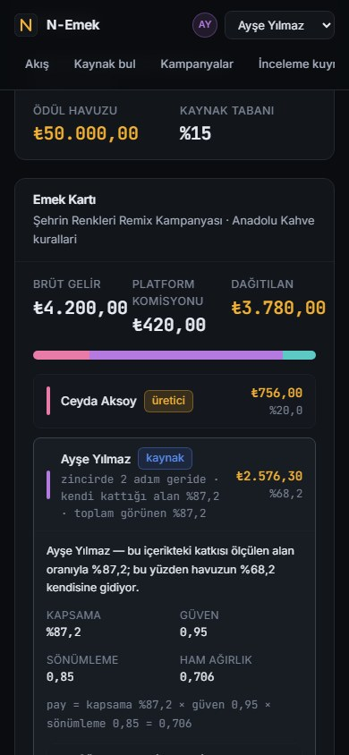

# 09 · Prototip / Uygulama Geliştirme Durumu

## gelistirme
- **Tasarım ✓** · tasarım sistemi, renk disiplini, akışlar
- **Geliştirme ✓** · altı ekran, köken motoru, pay motoru
- **Entegrasyon ✓** · tek komutla Docker, sürekli tümleştirme
- **Test ✓** · 130 test (backend) ve 124 test (arayüz) <!-- sayim: backend, arayuz -->

## ekran_akis
{kirp=224,70,1344,640}

## ekran_bolge
{kirp=224,70,1344,745}

## ekran_mobil

## ekran_aciklama
Akış → Emek Kartı (köken ve pay dağılımı) → mobil görünüm. Canlı gösterim sunumun sonunda, jürinin çağrısıyla.

## tasarim
### Tasarım kararları
- Her renk tek anlam taşır: **altın** para, **yeşil** doğrulanmış, **mavi** zincir, **kırmızı** itiraz.
- Ölçülen bölge renk katmanıyla değil kontrastla gösterilir; görüntü kaybolmaz.
- Teknik ayrıntı katmanlıdır: önce düz cümle, istenirse ham ölçüm.

## erisilebilirlik
### Erişilebilirlik (WCAG 2.1 AA)
- 11 kusur bulundu: 10 tanesi düzeltildi, biri gerekçesiyle kabul edildi.
- Altı ekranda adsız etkileşimli öğe, eksik alternatif metin ve etiketsiz form alanı sayısı sıfır.
- Klavyeyle görsel yükleme, odak halkası, mobil yeniden akış ölçüldü.

## kullanici
### Kullanıcıyla sınandı
- **Araştırma:** dört profilden 10 görüşme. Katılımcıların 7 tanesi gelirden önce görünürlük istedi.
- **Kullanılabilirlik testi:** 5 katılımcı, SUS 60,0; hedef olan 68 altında kaldı.
- Yedi bulgunun altısı arayüzde kapatıldı; etkisi henüz yeniden ölçülmedi.

## not
Prototip fikir düzeyinde değil, çalışıyor. Tasarım, geliştirme, entegrasyon ve test aşamalarının hepsi tamamlandı: sistem Docker ile tek komutla ayağa kalkıyor ve her gönderimde sürekli tümleştirmede testler koşuyor. Ekranlarda akış, Emek Kartı ve mobil görünüm var. Tasarımda her rengin tek anlamı var; altın para, yeşil doğrulanmış, mavi zincir. Erişilebilirliği WCAG 2.1 AA ölçütüyle denetledik: 11 kusur bulduk, 10'unu düzelttik. Kullanıcıyla da sınadık. On görüşmede katılımcıların yedisi gelirden önce görünürlük istedi. Beş kişilik kullanılabilirlik testinde SUS puanımız 60 çıktı, hedefin altında. Bunu saklamıyoruz: yedi bulgudan altısını kapattık ama etkisini henüz yeniden ölçmedik. Sistemi sunumun sonunda canlı göstereceğiz.
